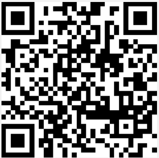

# NRF Sensor Test

This sensor sample demonstrates the usage of the Matter for displaying various sensor. The application also includes a sample on-off light, which controls LED1 on the NRF5340 DK board.

This device works as a Matter accessory device, meaning it can be paired and controlled remotely over a Matter network built on top of a low-power, 802.15.4 Thread network or on top of a Wi-Fi network.
Support for both Thread and Wi-Fi is mutually exclusive and depends on the hardware platform, so only one protocol can be supported for a specific light bulb device.
You can use this sample as a reference for creating your own application.

## Requirements

The sample is developed for the NRF5340DK, but other similar boards, could likely work with some minor modifications to the code. 

It uses two sensor:

* SCD30: This sample uses the SCD30 CO2, temperature, and relative humidity sensor for the temperature and humidity readings. It communicates over I2C protocol, and is configured to use pins P1.3 for SCL and P1.2 for SDA
* BH1750: The BH1750 illuminance sensor is used to update the matter illuminance attribute. It also uses the I2C protocol, and is configure to use pins P1.15 for SCL and P1.14 for SDA.

If you want to commission the light bulb device and control it remotely, you also need a Matter controller device configured on PC or mobile.

This requires additional hardware depending on the setup you choose.

## Overview

The sample contains four different attributes. A temperature, humidity, lux, on/off light.

* You can test it remotely over the Thread, which requires a thread border router, and a matter controller.

* The remote control testing requires a Matter controller that you can configure either on a PC or a mobile device (for remote testing in a network).

* You can enable both methods after building and running the sample.

## Remote testing in a network

* By default, the Matter accessory device has no IPv6 network configured.

* You must pair it with the Matter controller over Bluetooth® LE to get the configuration from the controller to use the device within a Thread or Wi-Fi network.

* The controller must get the onboarding information from the Matter accessory device and provision the device into the network.

* For details, see the commissioning the device section.

## Testing communication with another device

After building this sample and the Matter light switch sample and programming them to the development kits, complete the steps in the following sections to test communication between both devices.

## Commissioning the device

To commission the device, go to the [Testing Matter in the nRF Connect SDK](https://developer.nordicsemi.com/nRF_Connect_SDK/doc/latest/nrf/protocols/matter/getting_started/testing/index.html#ug-matter-gs-testing) page and complete the steps for the Matter over Thread or Matter over Wi-Fi development environment and the Matter controller you want to use.
After choosing the environment configuration, the guide walks you through the following steps:

* Configure the Thread Border Router (only for Matter over Thread communication).
* Build and install the Matter controller.
* Commission the device.
* Send Matter commands that cover scenarios described in the [testing](https://developer.nordicsemi.com/nRF_Connect_SDK/doc/latest/nrf/samples/matter/light_bulb/README.html#testing) section.

Before starting the commissioning procedure, the device must be made discoverable over Bluetooth LE.
The device becomes discoverable automatically upon the device startup, but only for a predefined period of time (15 minutes by default).
If the Bluetooth LE advertising times out, use one of the following buttons to enable it again:

## Onboarding information

When you start the commissioning procedure, the controller must get the onboarding information from the Matter accessory device.
The onboarding information representation depends on your commissioner setup.

For this sample, you can use one of the following onboarding information formats to provide the commissioner with the data payload that includes the device discriminator and the setup PIN code:

| QR Code   | QR Code Payload   | Manual pairing code   |
| ---       | ---               | ---                   |
|  | MT:6FCJ142C00KA0648G00 | 34970112332 |
|  | MT:Y.K9042C00KA0648G00 | 

## Dependencies

This sample uses the Matter library that includes the |NCS| platform integration layer:

In addition, it uses the [Matter](https://csa-iot.org/all-solutions/matter/) standard from the Connectivity Standards Alliance. 

The sample depends on the following Zephyr libraries:

* [Logging](https://developer.nordicsemi.com/nRF_Connect_SDK/doc/latest/zephyr/services/logging/index.html#logging-api)
* [Kernel](https://developer.nordicsemi.com/nRF_Connect_SDK/doc/latest/zephyr/kernel/services/index.html#kernel-api)
